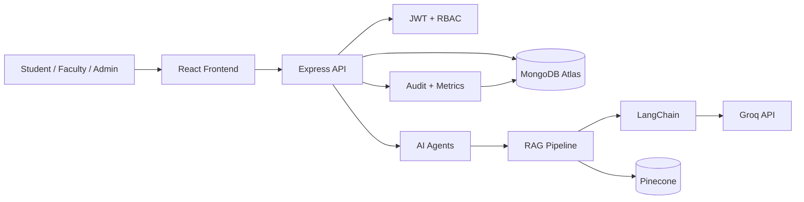

# AI-Powered LMS Tutor & Evaluation System

A production-ready full stack LMS platform demonstrating RAG, agentic AI workflows, role-based authentication, analytics, answer evaluation, and deployment readiness.

## Architecture



## Features

- Student, faculty, and admin authentication with JWT, bcrypt, protected routes, and role-based access control.
- Faculty material uploads for PDF, DOCX, and PPT/PPTX ingestion.
- LangChain RAG pipeline with Groq chat models, local embeddings, and Pinecone vector search.
- Multi-agent workflow: retriever, tutor, quiz, evaluation, and study planner agents.
- Adaptive quizzes with MCQ, true/false, short answer, and long answer questions.
- AI answer evaluation with score, feedback, missing concepts, and suggestions.
- Weak area detection, personalized study plans, dashboards, analytics, audit logs, and evaluation metrics.
- Prompt injection defense, validation, rate limiting, sensitive data masking, and upload restrictions.

## Folder Structure

```text
frontend/
backend/
agents/
rag/
uploads/
docs/
.env.example
README.md
```

The root `agents/` and `rag/` directories contain architecture notes. Runtime implementation lives in `backend/src/agents` and `backend/src/rag`.

## Environment Variables

Copy `.env.example` into `backend/.env` and `frontend/.env`.

```env
MONGODB_URI=
JWT_SECRET=
GROQ_API_KEY=
PINECONE_API_KEY=
PINECONE_INDEX=
FRONTEND_URL=
VITE_API_BASE_URL=
```

## Local Setup

Install backend dependencies:

```bash
cd backend
npm install
npm run dev
```

Install frontend dependencies:

```bash
cd frontend
npm install
npm run dev
```

Backend defaults to `http://localhost:5000`. Frontend defaults to Vite's local URL.

## API Overview

| Method | Endpoint | Roles | Purpose |
| --- | --- | --- | --- |
| POST | `/api/auth/register` | Public | Register user |
| POST | `/api/auth/login` | Public | Login and receive JWT |
| GET | `/api/users/me` | Authenticated | Current profile |
| GET/POST | `/api/courses` | Authenticated / Faculty/Admin | List or create courses |
| POST | `/api/materials/upload` | Faculty/Admin | Upload and index material |
| POST | `/api/tutor/ask` | Student | RAG grounded tutoring |
| POST | `/api/quizzes/generate` | Student | Generate adaptive quiz |
| POST | `/api/quizzes/attempts` | Student | Submit quiz attempt |
| POST | `/api/evaluations` | Student | Evaluate free-form answer |
| POST | `/api/study-plans` | Student | Generate study plan |
| GET | `/api/analytics/student` | Student | Student dashboard metrics |
| GET | `/api/analytics/faculty` | Faculty/Admin | Faculty dashboard metrics |
| GET | `/api/analytics/admin` | Admin | Admin dashboard metrics |
| GET | `/api/audit-logs` | Admin | Audit events |

## Security

- Passwords are hashed with bcrypt.
- JWT tokens are verified on protected routes.
- RBAC gates sensitive endpoints.
- Helmet, CORS, rate limits, request validation, and upload validation are enabled.
- Prompt injection patterns are blocked before AI calls.
- Audit logs capture login, upload, AI, evaluation, and admin activity.
- Secrets are read only from environment variables.

## Evaluation Metrics

The backend records accuracy, relevance, faithfulness, hallucination rate, latency, cost estimate, and user feedback score in MongoDB. These metrics are visible from analytics routes and admin dashboards.

## Deployment

### Backend on Vercel

1. Create a Vercel project from `backend/`.
2. Add environment variables from `.env.example`.
3. Ensure `vercel.json` points to `api/index.js`.
4. Deploy.

### Frontend on Vercel

1. Create a Vercel project from `frontend/`.
2. Set `VITE_API_BASE_URL` to your deployed backend URL.
3. Deploy with build command `npm run build`.

### MongoDB Atlas

Create a cluster, add the connection string to `MONGODB_URI`, and allow Vercel outbound access.

### Pinecone

Create a serverless index and set `PINECONE_API_KEY` and `PINECONE_INDEX`.

## Screenshots

- Landing Page: `docs/screenshots/landing.png`
- Student Dashboard: `docs/screenshots/student-dashboard.png`
- Faculty Dashboard: `docs/screenshots/faculty-dashboard.png`
- Admin Dashboard: `docs/screenshots/admin-dashboard.png`

## Future Enhancements

- LMS integrations with Moodle, Canvas, and Google Classroom.
- Streaming tutor responses.
- Human faculty review queues for flagged evaluations.
- More granular tenant isolation for universities.
- Offline batch analytics jobs.
